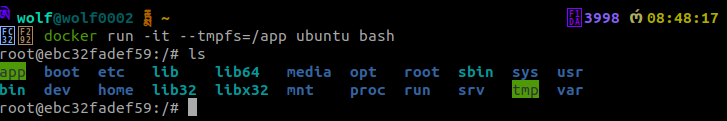

# Comandos docker
</img>


__fazendo login incluindo nome de usuario__
```docker

docker login -u erickwolf
```

__Para trocar o nome da imagem, digite o seguinte comando:__

```docker
docker tag <nomeAntigo>/<appAntigo>  <nomeNovo>/<appNovo>
```

- Imagens são imutáveis, ou seja, depois de baixadas, múltiplos containers conseguirão reutilizar a mesma imagem;

- Imagens são compostas por uma ou mais camadas. Dessa forma, diferentes imagens são capazes de reutilizar uma ou mais camadas em comum entre si;

- Podemos criar nossas imagens através de Dockerfiles e do comando docker build;

- Para subir uma imagem no Docker Hub, utilizamos o comando docker push.

__remover todos os containers que estão desativados:__

```docker
docker container rm $(docker container ls -aq)
```

__Remover todas as imagens__
```docker
docker rmi $(docker image ls -aq)
```
__Para forçar e remover iamgens__

```docker
docker rmi $(docker image ls -aq) --force
```


```docker
docker run -it ubuntu bash


docker ps -s -> mostra o tamanho do container
```
### === Utilizano o bind mounts ===

#### comandos Simples
```docker
docker container start <id>

docker container exec -it 033 bash

docker stop $(docker container ls -q)
```

### Persistir dados com container
- Duas formas de persistir dados em linha de comando com o docker

>__Primeira forma, com a flag -v:__
>```docker run -it -v $(pwd)/volume-docker:/app ubuntu bash ```

>__Segunda forma, com bind mount:__
>```docker run -it --mount type=bind,source=$(pwd)/volume-docker,target=/app ubuntu bash```

### Utilizando volumes

__Listar volumes:__

```docker
docker volume ls 
```
__Criar um volume docker:__

```docker
docker volume create meu-volume
```

__Rodando volume__
```docker
docker run -it -v meu-volume:/app ubuntu bash
```

>__Navegando até o caminho da pasta volume docker__
> ```cd /var/lib/docker/```
> -  obs! É preciso estar no modo admin no linux --> sudo su
> E depois entra na volumes

__Criando Volume com --mount__
```docker
docker run -it --mount source=meu-volume,target=/app ubuntu bash 
```
> __OBS!__ ***Quando uso esse comando, ele cria automaticamente um volume***

### Utilizando tmpfs

__Criando Volume com tmpfs__
```docker
docker run -it --tmpfs=/app ubuntu bash

ou

docker run -it --mount type=tmpfs,destination=/app ubuntu bash
```




Rapare que /app ficou verde,isso significa que vai armazenar dados temprários, ou seja, quando abrir outro container esse dados serão apresentados.
Então qual é a utilidade prática desse tipo de armazenamento que não armazena? A ideia do tmpfs é basicamente persistir dados na memória do seu host, mas esses dados não estão sendo escritos na camada de read-write. Eles estão sendo escritos diretamente na memória do host.

 Isso é importante, por exemplo, quando temos algum dado sensível que não queremos persistir na camada de read-write por questões de segurança talvez, mas queremos tê-los dentro de alguma maneira. Nesses casos podemos utilizar o tmpfs.


Então essa é a ideia do tmpfs. Caso queiramos colocar algum dado temporário que não deve ser armazenado de maneira alguma na camada de read-write, podemos utilizar o tmpfs também.

### Resumo

> - __Quando containers são removidos, nossos dados são perdidos;__
>- __Podemos persistir dados em definitivo através de volumes e bind mounts;__
>- __Bind mounts dependem da estrutura de pastas do host;__
>- __Volumes são gerenciados pelo Docker;__
>- __Tmpfs armazenam dados em memória volátil.__

## Comunicação através de Redes

### Conhecendo a rede bridge

__Listar as redes__

```docker
docker network  ls
```

__Mostrar informações do container__

```docker
docker inspect <id>
```
__Instalando o ping no container__

```docker
apt-get install iputils-ping -y
```
### Criando uma rede bridge

__Comando para criar uma rede bridge__

```docker
docker network create --driver bridge <nome>
```
__Comando que vai atrelar minha rede no container__

```docker
docker run -it --name <nomeContainer> --network <nomeRede> ubuntu bash
```

### As redes none e host

__Executar container na rede none__

```docker
docker run -d --network none ubuntu sleep 1d
```
Quando utilizamos o driver none, estamos simplesmente falando que esse container não terá qualquer interface de rede vinculada a ele. Ele ficou completamente isolado a nível de rede.

Nós não conseguimos fazer nenhum tipo de operação envolvendo a rede desse container, porque o driver dele é none, ele utiliza o driver null no fim das contas.

__Executar container na rede Host__

    docker run -d --network host aluradocker/app-node:1.0

 Porque nós simplesmente agora retiramos quaisquer isolamentos que tinham entre a interface de rede do container e do host. Porque utilizando o driver host nós estamos utilizando a mesma rede, a mesma interface do host que está hospedando esse container, por assim dizer.

 __OBS!! Então caso tivesse alguma outra aplicação na minha porta 3000 com meu host em execução, eu não conseguiria fazer a utilização desse container dessa maneira, daria um problema de conflito de portas, porque a interface seria a mesma.__

> A rede host remove o isolamento entre o container e o sistema, enquanto a rede none remove a interface de rede.

### Comunicando aplicação e banco

__Instalando o container mongo__

    docker pull mongo:4.4.6

__Instalando o alura-books__

    docker pull aluradocker/alura/books:1.0

__Rodando o mongo e atrelando uma rede nele__

    docker run -d --network minha-bridge --name meu-mongo mongo:4.4.6


__Rodando o alura-books e atrelando uma rede nele__

     docker run -d --network minha-bridge --name alurabooks aluradocker/alura-books:1.0 

### Resumo

- O docker dispõe por padrão de três redes: bridge, host e none;
- A rede bridge é usada para comunicar containers em um mesmo host;
- Redes bridges criadas manualmente permitem comunicação via hostname;
- A rede host remove o isolamento de rede entre o container e o host;
- A rede none remove a interface de rede do container;
- Podemos criar redes com o comando docker network create.

## Coordenando containers

### Conhecendo o docker compose

O Docker Compose nada mais é do que uma ferramenta de coordenação de containers. Não confunda com orquestração, são coisas diferentes.

Então o Docker Compose vai nos auxiliar a executar, a compor, como o nome diz, diversos containers em um mesmo ambiente, através de um único arquivo. Então vamos conseguir compor uma aplicação maior através dos nossos containers com o Docker Compose.


E faremos isso através da definição de um arquivo yml, aquela extensão yml, ou yaml, caso você já tenha ouvido falar. E nada mais é do que um tipo de estrutura que vamos seguir baseado em indentação do nosso arquivo.

### Definindo serviços
```yml
#Versão do arquivo
version: "3.3"

#Serviços
services:
  #Posso colocar qualquer nome
  mongodb:
    #Nome da imagem
    image: mongo:4.4.6
    #nome do container
    container_name: meu-mongo
    #Minha Rede
    networks: 
      - compose-bridge
  
  alurabooks:
    image: aluradocker/alura-books:1.0
    container_name: alurabooks
    networks:
      - compose-bridge
    ports:
      - 3000:3000

#Criando minha rede bridge
networks:
  compose-bridge:
    driver: bridge
```

## Complementando o compose

```yml
#Versão do arquivo
version: "3.3"

#Serviços
services:
  #Posso colocar qualquer nome
  mongodb:
    #Nome da imagem
    image: mongo:4.4.6
    #nome do container
    container_name: meu-mongo
    #Minha Rede
    networks: 
      - compose-bridge
  
  alurabooks:
    image: aluradocker/alura-books:1.0
    container_name: alurabooks
    networks:
      - compose-bridge
    ports:
      - 3000:3000
    depends_on:
      - mongodb

#Criando minha rede bridge
networks:
  compose-bridge:
    driver: bridge
```

__depends_on__:Ela expressa dependência entre serviços. No momento em que colocamos uma dependência de um serviço para outro, ele vai iniciar o serviço nessa ordem específica.

 No momento em que fizermos a execução, ele vai esperar o serviço subir. Mas tem um pequeno detalhe: o depends_on não vai esperar necessariamente a aplicação dentro do container estar pronta para receber as requisições. O que ele vai fazer é esperar o container ficar pronto, o que não significa que a aplicação dentro do container já está pronta.

>__Subir um docker compose__
>```docker-compose up```
>
>__Remover um docker compose__
>```docker-compose down```
>
>__Listar docker compose__
>```docker-compose ps```
>
>__Subir um docker compose no modo ***detached***__
> ```docker-compose up -d```

## Resumo

- O Docker Compose é uma ferramenta de coordenação de containers;
- Como instalar o Docker Compose no Linux;
- Como iniciar containers em conjunto com o comando docker-compose up;
- Como criar um arquivo de composição e definir instruções de containers, redes e serviços.
